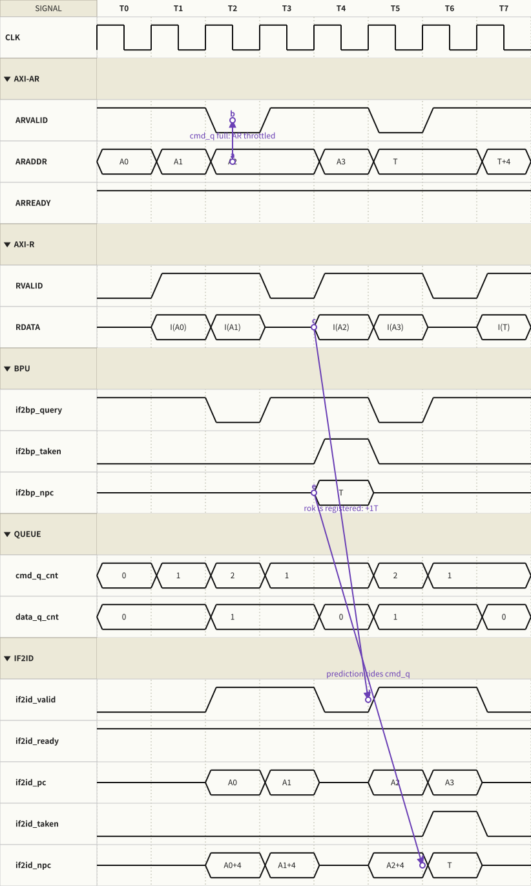
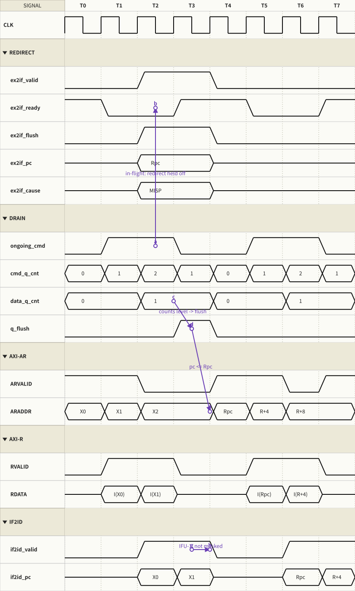
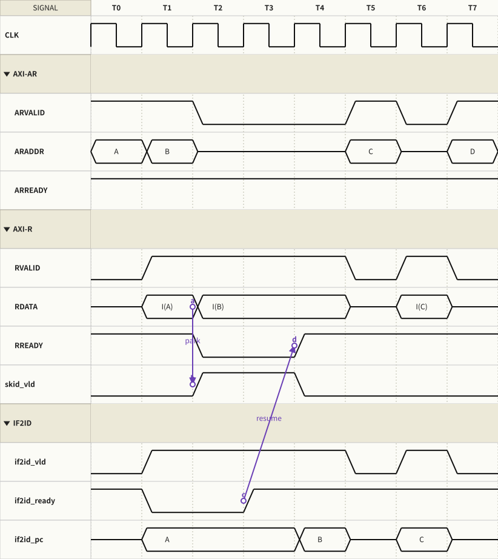

# IFU (Instruction Fetch Unit) Design Specification

> 版本:v0.1(draft)
> 適用架構:四級管線 IF / ID / EX / WB,EX 內含變動延遲、單一佔用
> 相關單元:BPU(獨立於 stage 之外,分 policy 與 prediction table 兩層)

---

## 1. 概述

IFU 負責且**僅**負責:決定下一個取指位址、透過 AXI AR/R channel 對指令記憶體發出讀取、
把取回的指令連同預測 metadata 交付給 ID。

IFU **不**包含:

- 預測儲存體與預測決策(BHT / BTB / RAS)→ 屬於 BPU
- 誤預測裁決 → 屬於 BPU(於 EX 解析拍,用隨管線走的 metadata 比對)
- 管線 flush 的執行 → ID / EX 各自依 flush 訊號清除

設計原則:

1. **所有介面 ready/valid 化**;IFU 不知道下游「為什麼」停,只看 `if2id_ready`。
2. **`ARADDR` 路徑僅一層 mux**:next-pc 的三個輸入(redirect / 預測 / 順序)全為暫存器輸出。
3. **不依賴時序巧合**:in-flight 請求的丟棄用顯式的 discard 記帳,
   不依賴「記憶體固定 1 拍回應、flush 脈波恰好對齊」的隱含前提
   (該前提在 AXI 變動延遲下不成立)。

---

## 2. 架構圖

```
                                  ┌─────────────────────────────┐
                                  │            BPU              │
                                  │  (policy + Bht/Btb/Ras)     │
                                  └───┬───────▲───────────┬─────┘
                             pred_vld │       │ query_vld │ redirect_vld
                             pred_pc  │       │ query_pc  │ redirect_pc
                                      │       │           │ redirect_cause
                                      ▼       │           ▼      ▲ redirect_ready
      ┌───────────────────────────────────────┴──────────────────┴──────┐
      │                              IFU                                │
      │  ┌──────────┐   ┌───────────────────┐   ┌────────────────────┐  │
      │  │  NextPc  │──▶│     FetchAxi      │──▶│    RespBuffer      │  │
      │  │ pc_q/mux │   │ AR/R FSM          │   │ 1-deep skid        │  │
      │  │          │   │ ar_pending        │   │ + pred pairing     │  │
      │  │          │   │ discard           │   │                    │  │
      │  └──────────┘   └───┬───────▲───────┘   └─────────┬──────────┘  │
      └─────────────────────┼───────┼─────────────────────┼─────────────┘
                    AR: ARVALID/ARADDR   R: RVALID/RDATA  │ if2id_vld/payload
                        ARREADY ▲            RRESP        ▼ if2id_ready ▲
                  ┌─────────────┴──────────────┐    ┌──────────────────┴───┐
                  │   Inst. Memory (AXI slave) │    │         IDU          │
                  └────────────────────────────┘    └──────────────────────┘
```

子模組職責:

| 子模組 | 職責 |
|---|---|
| `NextPc` | next-pc 優先權選擇、`pc_q` 維護(吸收原 `PcGen`) |
| `FetchAxi` | AR/R 握手 FSM、outstanding(`ar_pending`)與 `discard` 記帳 |
| `RespBuffer` | R beat 捕捉、1-deep skid、預測 metadata 與指令配對、IF→ID 握手 |

---

## 3. 介面定義

### 3.1 AXI AR / R channel(instruction memory master)

| Signal | Dir | Width | 說明 |
|---|---|---|---|
| `ARVALID` | out | 1 | 讀取請求 valid;拉起後至 `ARREADY` 前位址保持穩定 |
| `ARREADY` | in  | 1 | slave 可接受請求 |
| `ARADDR`  | out | 32 | 取指位址(word aligned) |
| `ARPROT`  | out | 3 | 常數 `3'b100`(instruction access) |
| `RVALID`  | in  | 1 | 回應 valid |
| `RREADY`  | out | 1 | IFU 可接受回應;`= ~skid_full` |
| `RDATA`   | in  | 32 | 指令 |
| `RRESP`   | in  | 2 | **slave 回報**的存取結果;非 `OKAY` 記為 fetch fault(§5.6) |

協議約束:

- **Outstanding = 1**:AR 發出後,對應 R beat 被接受前不再發 AR。
- **Issue 事件** ≜ `ARVALID & ARREADY`;`pc_q` 僅在此事件更新。
- `ARVALID = ~ar_pending & ~skid_full`(skid 滿時不預借請求,R 通道由 RREADY 反壓)。
- 單 beat(無 burst / 無 ID);未來上 I-Cache 需 burst 時升級為完整 AXI4,channel 結構不變。

### 3.2 Inst. interface(IF → ID)

| Signal | Dir | Width | 說明 |
|---|---|---|---|
| `if2id_vld`   | out | 1 | payload 有效(skid 非空或 R beat passthrough) |
| `if2id_ready` | in  | 1 | ID 可接受;**下游所有 stall 原因的唯一匯流點** |
| `pc`          | out | 32 | 指令自身位址(AUIPC / JAL / branch target / resolve 共用) |
| `inst`        | out | 32 | 指令 |
| `pred_taken`  | out | 1 | 該指令被 BPU 預測為 taken |
| `pred_npc`    | out | 32 | **該指令之後 IFU 實際發出的下一個取指位址**(§5.4) |
| `ghist`       | out | 4 | 查表當拍的 speculative global history 快照(gshare 訓練用) |
| `fault`       | out | 1 | `RRESP != OKAY`(預留,trap 機制完成前 ID 不動作) |

### 3.3 BPU interface(query / response,皆無 ready)

| Signal | Dir | Width | 說明 |
|---|---|---|---|
| `query_vld` | out | 1 | = AR issue 事件;以發出中的位址查表 |
| `query_pc`  | out | 32 | = `ARADDR` |
| `pred_vld`  | in  | 1 | 下一拍回(BPU 內部打拍);**兼作 taken**:1 = 預測 taken |
| `pred_pc`   | in  | 32 | taken 時的預測目標 |

- 不設 ready 的理由:表為 FF 實作,讀口恆可用;讀寫同拍碰撞時讀到舊值,無害。
  誤預測當拍的並行查詢屬錯誤路徑,結果隨 discard 一併作廢,無「等表更新」的需求。
  (Caveat:表改單口 SRAM 時需重新引入 stall。)

### 3.4 Redirection interface(→ IFU;ready 由 IFU 提供)

| Signal | Dir | Width | 說明 |
|---|---|---|---|
| `redirect_vld`   | in  | 1 | 來源 **hold 至被接受**(valid-held) |
| `redirect_pc`    | in  | 32 | 恢復位址 |
| `redirect_cause` | in  | 2 | `00`=MISPREDICT / `01`=TRAP / `10`=MRET / `11`=保留 |
| `redirect_ready` | out | 1 | = 該位址完成 AR issue 的那拍 |

- 現階段唯一來源為 BPU(MISPREDICT);IFU 不解讀 cause,僅轉發給 debug/trace。
- 多來源(未來 trap 單元)時於 IFU 內加 `RedirectArb` 子模組:
  優先權 TRAP > MISPREDICT,ready 僅回給被選中來源,落選者持續 hold。

### 3.5 其他

| Signal | Dir | Width | 說明 |
|---|---|---|---|
| `boot_addr` | in | 32 | `pc_q` reset 值 |
| `CLK` / `RSTN` | in | 1 | 時脈 / 非同步低有效重置 |

---

## 4. Next-PC 決策(核心定義)

```
next_pc = redirect_vld ? redirect_pc :
          pred_vld     ? pred_pc     : pc_q;

AR issue 時:pc_q <= next_pc + 4       // reset 值 = boot_addr
```

- 三個輸入全為暫存器輸出(redirect 為 valid-held、pred 為 BPU 打拍回應、`pc_q` 自有),
  `ARADDR` 組合路徑 = 一層優先權 mux。
- 預測時序為「**issue 拍查表、導向下一發**」:查表與記憶體存取平行,
  taken 預測零 bubble(見 §6.1)。

---

## 5. 功能說明

### 5.1 Outstanding 與 discard

| 狀態 | 寬度 | 行為 |
|---|---|---|
| `ar_pending` | 1 | AR issue 置起;R beat 被接受(`RVALID & RREADY`)清除 |
| `discard`    | 1 | redirect 被接受時若 `ar_pending`(或同拍有 R beat 未消費)置起;下一個 R beat 丟棄(不進 skid、不出 if2id)後清除 |

錯誤路徑指令因此**不會進入 ID**;flush 訊號只需清除「已在 ID/EX 中」的指令。
redirect 接受當拍,pending 中的 BPU 預測回應一併作廢(同一清理域)。

### 5.2 RespBuffer(skid)與 RREADY

- R beat 到達且 `if2id_ready=1` 且 skid 空:**passthrough**(同拍交付,不增加延遲)。
- R beat 到達且 ID 未收:capture 進 1-deep skid;之後由 skid 供給 `if2id`。
- `RREADY = ~skid_full`;skid 滿時 R beat 由 slave 依 AXI 規則 hold(RVALID/RDATA 保持),
  等效第二層緩衝。
- **回應必被 capture**,不依賴記憶體「剛好保持 rdata」——這是與現行設計的關鍵差異。

### 5.3 預測配對

AR issue 拍以 `ARADDR` 查表(`query_vld`),BPU 打一拍回 `pred_vld/pred_pc`;
此結果屬於**該筆 fetch**,存於配對暫存器,與對應 R beat 會合後組成 payload 的
`pred_taken / pred_npc / ghist`。R 延遲 > 1 拍時配對暫存器隨 `ar_pending` 等待。

### 5.4 `pred_npc` 語意

`pred_npc` = 該指令之後 IFU 實際 issue 的位址(taken → `pred_pc`;not-taken → 該指令位址+4)。
EX 解析時 BPU 以單一比較裁決:

```
actual_npc = branch & taken ? pc + imm  :
             jal            ? pc + imm  :
             jalr           ? rs1 + imm : pc + 4;

mispredict  = (actual_npc != pred_npc);   // 方向錯 / target 錯 / 非分支誤標,一式涵蓋
redirect_pc = actual_npc;                 // 恢復位址即為它
```

### 5.5 Reset 行為

`RSTN` 釋放後 `pc_q = boot_addr`、`ar_pending = 0`、skid 空 → 第一拍即可發出首筆 AR。

### 5.6 Fetch fault(RRESP)

`RRESP` 由 **slave 端**驅動(`00`=OKAY、`10`=SLVERR、`11`=DECERR)。
取指打到未映射區時,AXI interconnect / default slave 回 `DECERR` ——
這同時解決了現行設計「取指到未映射位址永遠等不到回應而 hang」的問題。
IFU 僅將非 OKAY 記為 payload 的 `fault` bit 傳遞;
未來 trap 機制以此產生 instruction access fault。

---

## 6. 波形

### 6.1 穩態連續取指(含一次 taken 預測,零 bubble)



- T0–T2:順序取指 `A → A+4 → A+8`;每拍 AR issue 同拍以該位址查表。
- T2 查 `A+8` 命中且 counter 判 taken → **T3** `pred_vld=1`、`pred_pc=T`,
  next-pc mux 選 `T` 發出 —— 順序路徑本來也在 T3 發下一筆,故 **taken 預測零 bubble**。
- `A+8` 的 R beat 於 T3 回來,與其預測配對:payload `pred_taken=1`、`pred_npc=T`。
- 標註 `1T lookup`:查表結果打一拍(issue 拍查、下一拍用),
  `ARADDR` 組合路徑上不含表讀出邏輯。

### 6.2 誤預測 redirect 與 in-flight 丟棄



- T0–T1:錯誤路徑 `X1 / X2` 取指中;`X1` 於 T1 交付 ID(其後由 flush 於 ID/EX 清除)。
- T2:BPU 裁決誤預測,`redirect_vld=1`、`redirect_pc=Rpc`、cause=MISPREDICT;
  redirect 於 next-pc mux 最高優先 → 同拍 AR issue `Rpc`、`redirect_ready=1` 回應。
- 同一拍 `X2` 的 R beat 到達 → `discard` 丟棄,`if2id_vld=0`:**`X2` 不進 ID**。
- T3 起恢復路徑 `Rpc, R+4, …` 正常交付;誤預測總 penalty = 2 拍(1-cycle memory 時)。

### 6.3 ID 反壓、skid 與 AXI 節流



- T1:`I(A)` 到達但 `if2id_ready=0` → `A` 進 skid(`skid_vld` T2 起);同拍 AR 已發 `B`。
- T2–T3:skid 滿 → `RREADY=0`,`I(B)` 由 slave hold 於 R channel(等效第二層緩衝);
  `ARVALID=0`(skid 滿不發新請求)。
- T3:`if2id_ready=1` → `A` 自 skid 消費;T4 `RREADY` 回高收下 `B` 並 passthrough 交付。
- T5 起恢復:AR `C` 發出,管線回到穩態。反壓全程無資料遺失、無重複交付。

---

## 7. 設計理由記錄(Design Rationale)

1. **`pred_npc` 單一比較取代方向/target 分項檢查**:
   舊架構以 `inst_pc` 反推「當初預測了什麼」,曾造成 JALR flush 公式錯誤、
   非分支誤標 taken 時跳往 `0x4`、taken 分支 target 未驗證三類問題;
   metadata 隨管線走使這類 bug 結構上不存在。
2. **BPU query/resp 無 ready**:見 §3.3。表讀口恆可用 + 錯誤路徑查詢必被作廢。
3. **非 BPU 來源 redirect(TRAP/MRET)需同時通知 BPU**:
   BPU 的 speculative 狀態(`ghist_spec`、RAS spec)含有被 flush 掉的路徑所推入的更新,
   不回復到 architectural 版本會污染後續預測。屬預測準確度(效能)問題而非功能正確性
   ——預測永遠會被驗證——但回復機制既已存在(誤預測路徑同款),接上即可。
4. **RRESP 為 slave 回報而非 master 指定**:見 §5.6。
5. **Outstanding = 1**:與 EX 單一佔用哲學一致;discard 記帳退化為 1 bit;
   1-cycle memory 下 IPC 與現行等價。多 outstanding 留待 I-Cache/prefetch 需求出現。

---

## 8. 待辦與依賴

- [ ] ID 介面定義(`if2id_ready` 聚合條件、ID→EX payload)——下一階段
- [ ] BPU 規格(query 管線、resolve、訓練、Bht/Btb/Ras 儲存層介面)
- [ ] BTB index/tag 位元配置(index 自 `pc[2]` 起;tag 覆蓋至系統映射的有效位元)
- [ ] `AxiMemSlave`:MemoryModel 的 AXI wrapper(sim 用;含 RVALID hold 行為)
- [ ] Trap 單元接入:`RedirectArb`(TRAP > MISPREDICT)、BPU `ext_flush`、`fault` 消費
```

---

*波形以 [RetroWave](https://github.com/ruiuri0423/retrowave) 產生;
來源腳本見 repo 外部工作區(`gen_ifu_waves.py`),波形檔位於 `DOC/waveform/`。*
