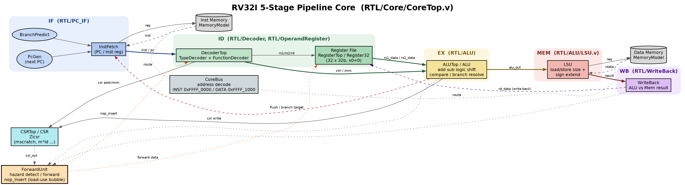

# RISC-V

---
### ISA Support (vs. `DOC/riscv-unprivileged.pdf`)
Implemented:
- **RV32I base integer ISA (complete, 37 instructions)**
  - Reg-Reg : `ADD SUB SLL SLT SLTU XOR SRL SRA OR AND`
  - Reg-Imm : `ADDI SLTI SLTIU XORI ORI ANDI SLLI SRLI SRAI`
  - Upper   : `LUI AUIPC`
  - Jump    : `JAL JALR`
  - Branch  : `BEQ BNE BLT BGE BLTU BGEU`
  - Load    : `LB LH LW LBU LHU`
  - Store   : `SB SH SW`
- **Zicsr** : `CSRRW CSRRS CSRRC CSRRWI CSRRSI CSRRCI`
  - CSRs implemented: `mvendorid marchid mimpid mhartid mconfigptr mscratch`

Not yet implemented / gaps (see Todo):
- `FENCE` (`MISC_MEM` opcode is decoded but ignored)
- `ECALL` / `EBREAK` (SYSTEM funct3=0 not decoded)
- Trap/exception CSRs: `mstatus mie mip mtvec mepc mcause mtval misa`
- Read-only CSRs (`mvendorid` etc.) are currently writable (not spec-compliant)
- Counters (Zicntr): `RDCYCLE RDTIME RDINSTRET`
- Misaligned load/store handling & access-fault exceptions
- Extensions M / A / F / D / C
---
### File Arch.
  ```
  RTL : Source code of rv32i_core.
  SIM : Simulation environment (sim/debug).
  testbench : Assembly code pattern / SystemVerilog bench.
  ```

### How to run simulation
  ```
  cd ./SIM/
  ./run_vcs.bash hello
  ```
### How to open verdi
  ```
  cd ./SIM/
  ./run_verdi.bash
  ``` 
### Todo List
- [x] Architecture Diagram
- [x] RV32I base integer ISA (complete)
- [x] Control and Status Register (CSR) — Zicsr instructions + basic M-mode info CSRs
- [ ] LSU re-design.
- [ ] Memory Access Mechanism Optimized
- [ ] BUS Interface
- [ ] `FENCE` (currently decoded but ignored)
- [ ] `ECALL` / `EBREAK` (SYSTEM funct3=0)
- [ ] Trap / exception handling + CSRs (`mstatus`, `mtvec`, `mepc`, `mcause`, `mtval`, `mie`, `mip`)
- [ ] Enforce read-only CSRs (`mvendorid`/`marchid`/`mimpid`/`mhartid`/`mconfigptr`)
- [ ] Hardware counters (Zicntr: `cycle` / `time` / `instret`)
- [ ] Misaligned access & access-fault exceptions
- [ ] Interrupt
- [ ] L1 I-Cache
- [ ] L1 D-Cache
- [ ] Extensions: M (mul/div) / A (atomic) / C (compressed)